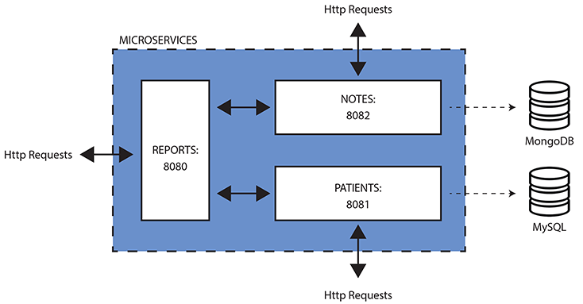

# Develop a Complete Application For Your Client Using Agile Techniques

## Project structure
Multi-Module Maven project which includes: patients, notes and reports modules.

- Patients - patient demographic (name, age, etc.) information stored in MySQL DB
- Notes - patient notes stored in Mongo DB
- Reports - calculates a patient's risk for diabetes based on their demographic and note history

## Architectural Diagram

## Build and run project

### Build Maven project
 - mvn install
 
### Build Docker with docker-compose build
1. Building up mySql and mongodb: 
    - docker-compose up db-mysql
    - docker-compose up mongodb
2. Building up patientsApp: 
    - docker -compose up patients
3. Building up notesApp:
    - docker -compose up notes
4. Building up reportsApp:
    - docker -compose up reports